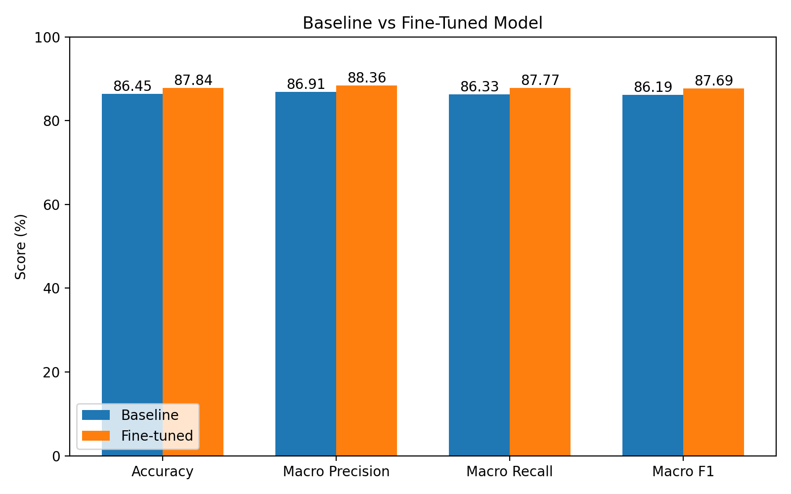
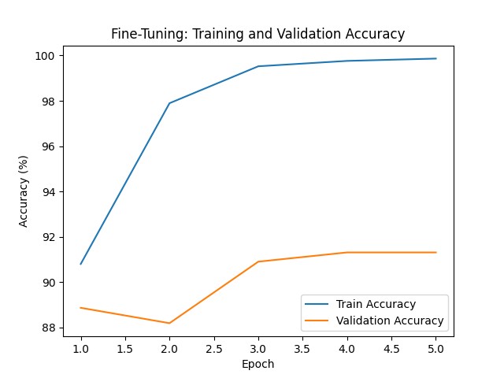
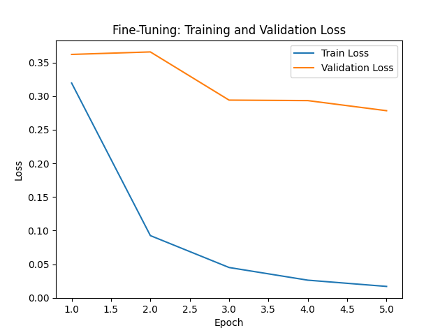
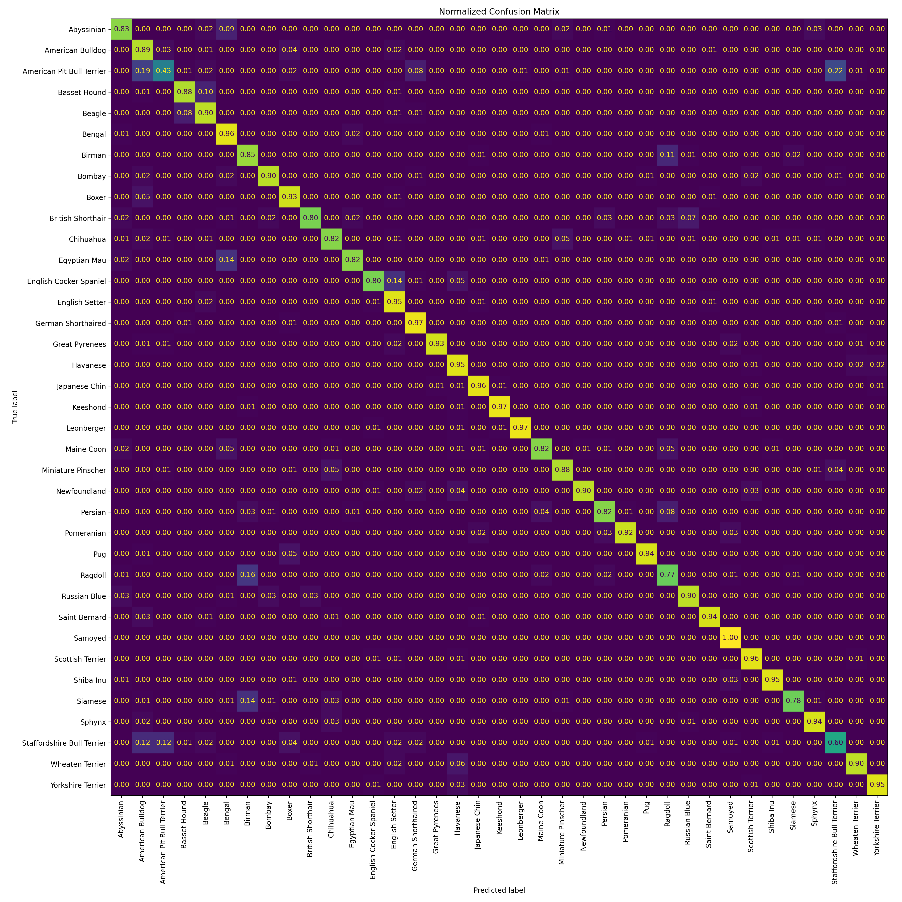

# Oxford-IIIT Pet Transfer Learning

Image classification on the **Oxford-IIIT Pet Dataset** using transfer learning and partial fine-tuning with a pretrained **ResNet18** in PyTorch.

This project compares two transfer-learning strategies:

1. **Frozen-backbone baseline** — the pretrained ResNet18 backbone is frozen and only the final classifier is trained.
2. **Partial fine-tuning** — the final ResNet18 stage (`layer4`) is unfrozen and trained together with the classifier.

The fine-tuned model improves the controlled baseline across all reported test metrics, reaching **87.84% test accuracy** and **87.69% macro F1-score**.

---

## Overview

The project implements an end-to-end computer vision pipeline including:

- Oxford-IIIT Pet dataset loading
- Train/validation/test data handling
- Image preprocessing and augmentation
- Reproducible train/validation splitting
- Transfer learning with pretrained ResNet18
- Frozen-backbone baseline training
- Partial backbone fine-tuning
- Different learning rates for pretrained and task-specific layers
- Training and validation loops
- Best-model checkpointing
- Training and validation metric tracking
- Evaluation on the official test split
- Per-class precision, recall, and F1-score
- Normalized confusion matrices
- Baseline vs. fine-tuned performance comparison

---

## Dataset

The project uses the **Oxford-IIIT Pet Dataset**, which contains images from **37 cat and dog breeds**.

The official `trainval` split is divided into:

- **80% training**
- **20% validation**

A fixed PyTorch random generator seed is used so that the same train/validation split is reproduced across runs.

The official `test` split is kept separate and is used for final evaluation.

All images are resized to:

```text
224 × 224
```

and normalized using ImageNet statistics:

```text
mean = [0.485, 0.456, 0.406]
std  = [0.229, 0.224, 0.225]
```

Training images additionally use random horizontal flipping as data augmentation. Validation and test images do not use random augmentation.

---

## Model

The project uses **ResNet18 pretrained on ImageNet**.

The original ImageNet classifier:

```text
Linear(512, 1000)
```

is replaced with:

```text
Linear(512, 37)
```

to support the 37 Oxford-IIIT Pet classes.

### Baseline

For the baseline model, the entire pretrained backbone is frozen and only the new classification layer is trained.

```text
Input Image
    ↓
Pretrained ResNet18 Backbone
    ↓
Frozen
    ↓
512-dimensional feature vector
    ↓
Linear(512, 37)
    ↓
Trainable
    ↓
37 breed logits
```

This uses ResNet18 as a fixed feature extractor.

### Partial Fine-Tuning

After baseline training, the best baseline checkpoint is used as the starting point for fine-tuning.

The final ResNet18 stage, `layer4`, is unfrozen while the earlier backbone stages remain frozen:

```text
Input Image
    ↓
conv1 / layer1 / layer2 / layer3
    ↓
Frozen
    ↓
layer4
    ↓
Trainable
    ↓
Linear(512, 37)
    ↓
Trainable
    ↓
37 breed logits
```

Different learning rates are used for the pretrained and task-specific components:

```text
layer4 learning rate    = 1e-4
classifier learning rate = 1e-3
```

The smaller learning rate for `layer4` allows pretrained visual representations to adapt gradually without making overly large updates to useful ImageNet features.

Frozen backbone stages are kept in evaluation mode during fine-tuning so that their BatchNorm running statistics remain unchanged.

---

## Training

### Baseline Training

The baseline model is trained for **10 epochs** using:

- Loss: `CrossEntropyLoss`
- Optimizer: Adam
- Classifier learning rate: `1e-3`
- Batch size: `32`

Only the final fully connected layer is optimized.

### Fine-Tuning

The fine-tuned model starts from the best baseline checkpoint and is trained for **5 additional epochs** using:

- `layer4` learning rate: `1e-4`
- Classifier learning rate: `1e-3`

The best checkpoint is selected using validation accuracy.

Separate checkpoints are generated for the two stages:

```text
outputs/checkpoints/best_model.pth
outputs/checkpoints/best_finetuned_model.pth
```

Checkpoint files are excluded from Git because they are generated artifacts and relatively large.

---

## Results

A controlled comparison was performed using a baseline model and the fine-tuned model initialized directly from that same baseline checkpoint.

### Validation Performance

| Model | Best Validation Accuracy |
|---|---:|
| Frozen-backbone baseline | **88.32%** |
| Partial fine-tuning | **91.30%** |

Partial fine-tuning improved the best validation accuracy by **2.98 percentage points**.

### Test Performance

Both models were evaluated on the same official Oxford-IIIT Pet test split.

| Metric | Baseline | Fine-Tuned | Improvement |
|---|---:|---:|---:|
| Test Accuracy | 86.45% | **87.84%** | **+1.39 pp** |
| Macro Precision | 86.91% | **88.36%** | **+1.45 pp** |
| Macro Recall | 86.33% | **87.77%** | **+1.44 pp** |
| Macro F1-score | 86.19% | **87.69%** | **+1.50 pp** |

Partial fine-tuning improved all four reported test metrics.

The improvement in both accuracy and macro-averaged metrics indicates that fine-tuning improved performance across the class set rather than only helping a small subset of breeds.

---

## Baseline vs. Fine-Tuned Model



The fine-tuned model consistently outperforms the frozen-backbone baseline across accuracy, macro precision, macro recall, and macro F1-score.

---

## Baseline Learning Curves

### Accuracy


### Loss


The baseline training loss decreases steadily while validation performance begins to plateau during later epochs.

This suggests that the final classifier approaches the limit of what can be achieved using completely frozen ImageNet features.

---

## Fine-Tuning Learning Curves

### Accuracy



### Loss



During fine-tuning, training accuracy approaches 100%, while validation accuracy stabilizes around 91%.

This creates a noticeable train-validation gap, showing that the model has enough capacity to fit the training set very strongly.

However, validation loss continues to decrease through the tested five-epoch fine-tuning window, while validation accuracy improves relative to the baseline. Therefore, the selected fine-tuning stage still provides useful generalization improvements, although longer fine-tuning would likely require stronger regularization or early stopping.

---

## Confusion Matrix Analysis

### Baseline


### Fine-Tuned



The confusion matrices show strong performance for many breeds, while several visually similar breeds remain challenging.

Examples of strong fine-tuned performance include:

- Samoyed
- Leonberger
- Keeshond
- Japanese Chin
- Shiba Inu
- Great Pyrenees
- Yorkshire Terrier

One of the main remaining failure modes involves visually similar bulldog and terrier breeds, particularly:

- American Bulldog
- American Pit Bull Terrier
- Staffordshire Bull Terrier

These classes share similar facial structure, body shape, coat appearance, and other visual characteristics.

Partial fine-tuning improves several difficult classes but does not completely eliminate these breed-level ambiguities.

---

## Project Structure

```text
oxford-pet-transfer-learning/
├── outputs/
│   ├── checkpoints/
│   │   ├── best_model.pth
│   │   └── best_finetuned_model.pth
│   │
│   └── figures/
│       ├── accuracy_curve.png
│       ├── loss_curve.png
│       ├── finetune_accuracy_curve.png
│       ├── finetune_loss_curve.png
│       ├── current_baseline_confusion_matrix.png
│       ├── finetune_confusion_matrix.png
│       └── baseline_vs_finetuned.png
│
├── src/
│   ├── __init__.py
│   ├── data.py
│   ├── model.py
│   ├── train.py
│   ├── finetune.py
│   └── evaluate.py
│
├── .gitignore
├── LICENSE
├── README.md
└── requirements.txt
```

Downloaded dataset files and model checkpoints are excluded from Git.

---

## Source Files

### `src/data.py`

Handles:

- Oxford-IIIT Pet dataset download
- Image preprocessing
- ImageNet normalization
- Training augmentation
- Reproducible 80/20 train-validation split
- Official test split
- Train, validation, and test DataLoaders

### `src/model.py`

Contains model construction utilities.

It creates:

- The frozen-backbone ResNet18 baseline
- The partial fine-tuning model initialized from the best baseline checkpoint

The original ResNet18 classifier is replaced with a 37-class output layer.

### `src/train.py`

Implements baseline training with:

- Frozen pretrained backbone
- Cross-entropy loss
- Adam optimization
- Training loss tracking
- Training accuracy tracking
- Validation loss tracking
- Validation accuracy tracking
- Best-model checkpointing
- Accuracy and loss visualization

### `src/finetune.py`

Continues training from the best baseline checkpoint.

It:

- Unfreezes `layer4`
- Keeps earlier ResNet stages frozen
- Keeps BatchNorm statistics fixed in frozen stages
- Uses separate learning rates for `layer4` and the classifier
- Tracks training and validation metrics
- Saves the best fine-tuned checkpoint
- Generates separate fine-tuning learning curves

### `src/evaluate.py`

Evaluates a supplied model checkpoint on the official test set.

Reported metrics include:

- Accuracy
- Macro precision
- Macro recall
- Macro F1-score
- Per-class classification report
- Normalized confusion matrix

The evaluation function supports compatible checkpoints through a configurable checkpoint path.

---

## Installation

Clone the repository:

```bash
git clone https://github.com/mahdi0x06/oxford-pet-transfer-learning.git
cd oxford-pet-transfer-learning
```

Create a virtual environment:

```bash
python3 -m venv .venv
source .venv/bin/activate
```

Install dependencies:

```bash
python -m pip install -r requirements.txt
```

The main project dependencies are:

```text
torch
torchvision
matplotlib
scikit-learn
tqdm
```

---

## Running the Baseline

Train the frozen-backbone baseline:

```bash
python -m src.train
```

The best baseline checkpoint is saved to:

```text
outputs/checkpoints/best_model.pth
```

---

## Running Fine-Tuning

After the baseline checkpoint has been created, run:

```bash
python -m src.finetune
```

The fine-tuning process loads:

```text
outputs/checkpoints/best_model.pth
```

and saves the best fine-tuned checkpoint to:

```text
outputs/checkpoints/best_finetuned_model.pth
```

---

## Evaluation

Evaluate the baseline model:

```bash
python -m src.evaluate
```

The evaluation function also supports evaluating another compatible checkpoint by passing a custom path.

For example:

```python
from src.evaluate import evaluate

evaluate(
    checkpoint_path="outputs/checkpoints/best_finetuned_model.pth",
    confusion_matrix_path="outputs/figures/finetune_confusion_matrix.png"
)
```

---

## GPU Training

The project automatically uses CUDA when available:

```python
device = torch.device(
    "cuda" if torch.cuda.is_available() else "cpu"
)
```

Experiments were run using an NVIDIA **Tesla T4 GPU on Google Colab**.

The same code can run on CPU, although training is significantly slower.

---

## Reproducibility

The train-validation split uses a fixed PyTorch random generator seed:

```python
torch.Generator().manual_seed(42)
```

This ensures that the same samples are assigned to training and validation between runs.

Some randomness still remains in:

- Classification-head initialization
- Training-data shuffling
- Random horizontal augmentation

Fully deterministic training would require additional random-seed and backend configuration.

---

## Evaluation Protocol

The official test split is kept separate from model training.

- **Training set**: used for optimization
- **Validation set**: used to monitor training and select the best checkpoint
- **Test set**: used for final reporting

This separation helps reduce evaluation bias and provides a more meaningful estimate of performance on unseen data.

---

## Future Work

Potential extensions include:

- Stronger image augmentation
- Early stopping
- Learning-rate scheduling
- Weight decay and additional regularization
- Comparing different fine-tuning depths
- Full-backbone fine-tuning
- Comparing ResNet18 with architectures such as ResNet50, EfficientNet, or Vision Transformers
- More detailed analysis of visually similar breed pairs
- Class-specific augmentation or loss strategies for difficult breeds

---

## License

This project is released under the MIT License.