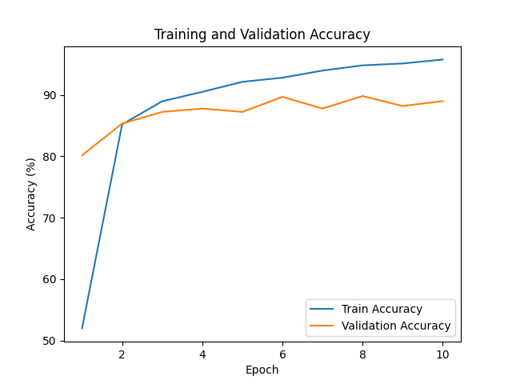
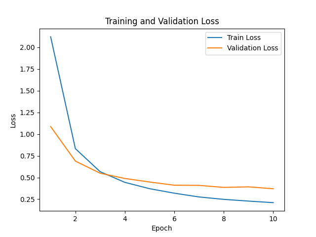

# Oxford-IIIT Pet Transfer Learning

Image classification on the **Oxford-IIIT Pet Dataset** using **transfer learning with a pretrained ResNet18** in PyTorch.

The current baseline uses a ResNet18 pretrained on ImageNet as a frozen feature extractor and replaces its original classifier with a new fully connected layer for the dataset's **37 pet breeds**.

## Overview

This project implements an end-to-end computer vision pipeline including:

* Dataset loading and preprocessing
* Train/validation splitting with a fixed random seed
* Data augmentation for training images
* ImageNet normalization
* Transfer learning with pretrained ResNet18
* Training and validation loops
* Best-model checkpointing
* Training/validation metric tracking
* Evaluation on the official Oxford-IIIT Pet test split
* Per-class precision, recall, and F1-score
* Normalized confusion matrix analysis

## Dataset

The project uses the **Oxford-IIIT Pet Dataset**, which contains images from **37 breeds of cats and dogs**.

The official `trainval` split is divided into:

* **80% training**
* **20% validation**

using a fixed random seed for reproducibility.

The official dataset `test` split is kept separate and is used only for final evaluation.

Images are resized to `224 × 224`, converted to PyTorch tensors, and normalized using the ImageNet statistics:

```text
mean = [0.485, 0.456, 0.406]
std  = [0.229, 0.224, 0.225]
```

Training images additionally use random horizontal flipping as data augmentation.

## Model

The baseline model is **ResNet18 pretrained on ImageNet**.

The pretrained backbone is frozen during baseline training:

```text
Input Image
    ↓
Pretrained ResNet18 Backbone
    ↓
512-dimensional feature vector
    ↓
Linear(512, 37)
    ↓
37 breed logits
```

Only the newly initialized classification layer is trained.

This allows the model to reuse visual representations learned from ImageNet while adapting the final classifier to pet-breed recognition.

## Baseline Results

The baseline classifier was trained for **10 epochs** using Adam with a learning rate of `0.001`.

Best validation accuracy:

**89.81%**

Performance on the official test split:

| Metric          |     Result |
| --------------- | ---------: |
| Test Accuracy   | **86.21%** |
| Macro Precision | **87.50%** |
| Macro Recall    | **86.12%** |
| Macro F1-score  | **86.07%** |

### Training and Validation Accuracy



### Training and Validation Loss



The training loss decreases consistently throughout training, while validation performance begins to plateau during later epochs. This creates a moderate train-validation gap, suggesting that the frozen-backbone classifier is approaching the limit of the current feature representation.

### Confusion Matrix


The confusion matrix shows that performance varies significantly across breeds.

Some classes achieve very strong performance, including:

* Keeshond
* Leonberger
* Great Pyrenees
* Japanese Chin
* Samoyed
* Yorkshire Terrier

Several visually similar breeds remain more challenging. For example, the baseline shows substantial confusion among **American Pit Bull Terrier, American Bulldog, and Staffordshire Bull Terrier**.

This motivates fine-tuning deeper layers of the pretrained backbone in future experiments.

## Project Structure

```text
oxford-pet-transfer-learning/
├── outputs/
│   └── figures/
│       ├── accuracy_curve.png
│       ├── loss_curve.png
│       └── confusion_matrix.png
├── src/
│   ├── __init__.py
│   ├── data.py
│   ├── model.py
│   ├── train.py
│   └── evaluate.py
├── .gitignore
├── LICENSE
├── README.md
└── requirements.txt
```

### `src/data.py`

Handles:

* Oxford-IIIT Pet dataset loading
* Image preprocessing
* Training augmentation
* Train/validation split
* Train, validation, and test DataLoaders

### `src/model.py`

Creates the pretrained ResNet18 model, freezes the pretrained backbone, and replaces the ImageNet classifier with a 37-class output layer.

### `src/train.py`

Implements:

* Training loop
* Validation loop
* Cross-entropy loss
* Adam optimization
* Accuracy and loss tracking
* Best-model checkpointing
* Learning-curve visualization

### `src/evaluate.py`

Loads the best saved model and evaluates it on the official test split using:

* Accuracy
* Macro precision
* Macro recall
* Macro F1-score
* Per-class classification report
* Normalized confusion matrix

## Running the Project

Clone the repository:

```bash
git clone https://github.com/mahdi0x06/oxford-pet-transfer-learning.git
cd oxford-pet-transfer-learning
```

Create and activate a virtual environment:

```bash
python3 -m venv .venv
source .venv/bin/activate
```

Install the main dependencies:

```bash
python -m pip install torch torchvision matplotlib scikit-learn tqdm
```

Train the baseline model:

```bash
python -m src.train
```

The best checkpoint is saved to:

```text
outputs/checkpoints/best_model.pth
```

Evaluate the saved model:

```bash
python -m src.evaluate
```

The dataset is downloaded automatically through `torchvision`.

## GPU Training

The code automatically uses CUDA when a compatible GPU is available:

```python
device = torch.device(
    "cuda" if torch.cuda.is_available() else "cpu"
)
```

The baseline experiments were also run using a **Tesla T4 GPU on Google Colab**.

## Next Steps

Planned improvements include:

* Fine-tuning the deeper ResNet18 layers
* Comparing frozen-feature extraction with full or partial fine-tuning
* Experimenting with stronger data augmentation
* Exploring learning-rate scheduling and early stopping
* Comparing ResNet18 with other pretrained architectures
* Performing deeper analysis of commonly confused breeds

## License

This project is released under the MIT License.
